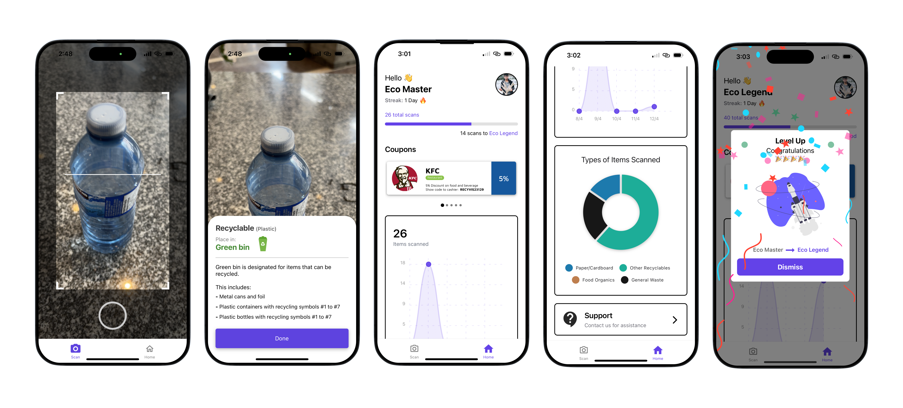

# Recycle Vision

## Table of Contents
- [Introduction](#introduction)
- [Features](#features)
- [Design](#design)
- [Screenshots](#screenshots)
- [Getting Started](#getting-started)
  - [Prerequisites](#prerequisites)
  - [Installation](#installation)
- [Build](#build)
- [Contributors](#contributors)
- [Contributing](#contributing)
- [License](#license)
- [Acknowledgements](#acknowledgements)

## Introduction

RecycleVision is an application developed as part of the SOEN 6751 HCI course. In this project, we aim to develop a mobile application that simplifies the process of waste sorting. The application will use visual cues and gamification to engage users and increase their confidence in waste disposal practices. It will also leverage image recognition technology to classify different types of waste, thereby reducing confusion and increasing accuracy in waste disposal.

## Features

The RecycleVision application offers the following features:

1. **Visual Cues for Waste Sorting**: The application uses visual cues to enhance user confidence and engagement in waste-sorting practices. This feature helps users to identify and sort waste correctly.

2. **Emotional Satisfaction**: The application is designed to impact the user's emotional response positively. It provides satisfaction to users by enabling them to dispose of waste effectively and correctly.

3. **Gamification of Waste Sorting**: The application incorporates gamification elements to encourage habitual correct waste sorting. This feature makes the waste sorting process more engaging and fun for users.

4. **Environmental Awareness**: The application aims to increase user's environmental awareness. It tracks the user's waste sorting practices before and after using the application, providing insights into their contribution to broader environmental practices.

## Design
For a comprehensive look at the design and user interface of this project, refer to our [Figma board](https://www.figma.com/file/UeeC6DDHtul2s2l4GV6J5Q/RecycleVision?type=design&node-id=984%3A542&mode=dev&t=IVVyrULoeEK5W3Cc-1). Here, you will find all the design resources that guide the development of the project.

## Screenshots


*RECYCLE VISION  GUI*

## Getting Started

### Prerequisites

Make sure you have Node and Yarn installed on your system. If not, download and install it from [nodejs.org](https://nodejs.org/en) [yarnpkg.com](https://classic.yarnpkg.com/en/).

### Installation

First, install the dependencies of RecycleVision:

```bash
yarn install
```

Second, run the development server using one of the following commands:

```bash
npm start
```

## Build
To generate the apk.
```bash
eas build -p android --profile preview
```
## Contributors

Thank you to the following contributors for their valuable contributions to the project:

- [Huzaifa Anjum](https://github.com/huzaifafcrit)
- [Shafiq Imtiaz](https://github.com/shafiqimtiaz)
- [Abderraouf Drine](https://github.com/AbderraoufDrine)
- [Peter Sakr](https://github.com/plsakr)
- [Vithu](https://github.com/DevV2M)
- [Anirudh Boddu](https://github.com/AnirudhBoddu)

Your efforts are greatly appreciated! 🙌

## Contributing

We welcome contributions! If you would like to contribute to Recycle Vision, please read our [contribution guidelines](CONTRIBUTING.md).

## License

This project is licensed under the [MIT License](LICENSE). See the [LICENSE](LICENSE) file for details.

## Acknowledgements

- A big thanks to the React Native Web development community for making Recycle Vision possible.
- Special thanks to our Professor [Mr. Anil Ufuk Batmaz](ufuk.batmaz@concordia.ca) for his guidance and support.